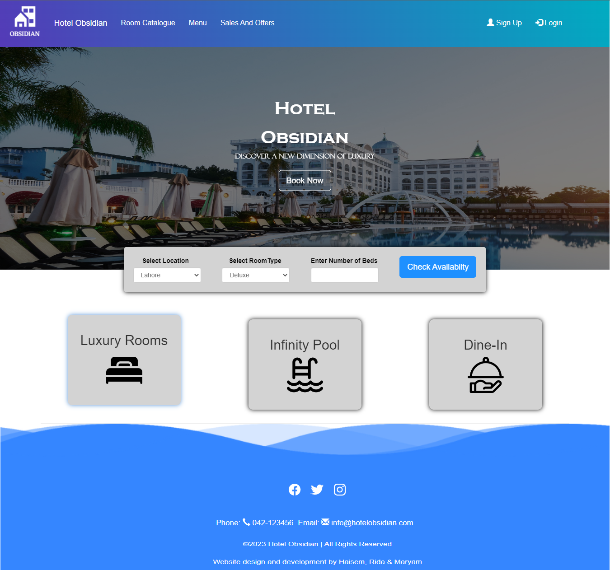

# Hotel Management System Web App



## Table of Contents

- [Introduction](#introduction)
- [Features](#features)
- [Class Diagram](#classdiagram)
- [Requirements](#requirements)
- [Installation](#installation)
- [Usage](#usage)
- [Contributing](#contributing)
- [License](#license)

## Introduction

The Hotel Management System Web App is a web-based application built using XAMPP and Django. This application simplifies the management of hotel operations, allowing hotel staff to efficiently manage reservations, check-ins, check-outs, room assignments, and more. It is designed to streamline hotel operations and provide a user-friendly experience for both staff and guests.

## Features

- **User Authentication**: Secure user authentication system for both staff and guests.
- **Room Management**: Easily add, edit, or delete rooms and room details.
- **Reservation Management**: Manage reservations, check availability, and view reservation history.
- **Check-In and Check-Out**: Process guest check-ins and check-outs smoothly.
- **Billing and Invoicing**: Generate bills and invoices for guests.
- **Guest Profiles**: Maintain guest profiles with personal information and preferences.
- **Staff Management**: Create and manage staff accounts with different roles and permissions.
- **Reporting**: Generate various reports, including occupancy rates, revenue, and more.

## Class Diagram


## Requirements

To run the Hotel Management System Web App, you need the following software and tools installed on your system:

- [XAMPP](https://www.apachefriends.org/index.html) - XAMPP is a web server package that includes Apache, MySQL, and PHP, making it easy to set up a local development environment.
- [Python](https://www.python.org/) - Python is used for Django development. Make sure you have Python 3.x installed.
- [Django](https://www.djangoproject.com/) - The web framework used to build the application.
- [Git](https://git-scm.com/) - Version control system (optional but recommended).

## Installation

Follow these steps to set up and run the Hotel Management System Web App:

1. Clone the repository to your local machine (or download the ZIP file and extract it).

```bash
git clone https://github.com/yourusername/hotel-management-system.git
```

2. Install Python dependencies

3. Create a MySQL database and update the database settings in the `settings.py` file with your database configuration.

4. Apply migrations to create the database tables:

```bash
python manage.py makemigrations
python manage.py migrate
```

6. Start the development server:

```bash
python manage.py runserver
```

7. Access the application in your web browser at `http://localhost:8000/`.

## Usage

- To access the admin panel, go to `http://localhost:8000/admin/` and log in with your credentials.

- As a superuser, you can manage rooms, reservations, staff, and more through the admin panel.

- Guests can make reservations and view their profiles by signing up and logging in.

- Staff members can manage reservations, check-ins, check-outs, and other hotel operations.
---
